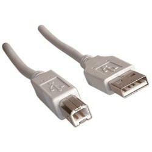

# Objetos Inteligentes Conectados - TADS - 5H11 - 1º Semestre 2018

# Documento de Visão do Projeto "Smart Lamp"

Este documento apresenta uma solução de software para o projeto *"Smart Lamp"*, 
apresentando os problemas a serem solucionados, as necessidades dos principais envolvidos, o alcance do projeto e as funcionalidades esperadas.

## Objetivos

* Possibilitar acessibilidade das luzes da casa através da rede
* Agilizar a tarefa de acender as luzes
* Possibilitar o controle da intensidade das luzes 

## Integração com outros sistemas

* MQTT Dashboar
* CloudMQTT
 
## Usuários

* Pessoas que desejam automatizar a tarefa cotidiana de acender as luzes
* Pessoas com dificuldades de locomoção

## Funcionalidades do produto

* Acender e apagar as luzes

## Hardware Utilizado

### Lista de componentes utilizados

Qtde |   Componente | Descrição | Foto 
-----|--------------|-----------|-----
01x  | Placa Uno R3 | Placa arduino uno utilizada para o controle das luzes | 
01x  |Cabo USB | Cabo para conexão da placa com o computador, usada para envio do código | 
01x  |Fonte DC Chaveada 9V 1A Plug P4 | Fonte de alimentação da placa para funcionamento após programação | 
01x  |Ethernet Shield W5100| Placa de comunicação do arduino com servidor Ethernet | 
01x  |Cabo de Rede Conector RJ45| Cabo que faz a conexão entre Shield e Computador | 
03x  |Jumpers Macho-Fêmea | Cabos que ligam os reles ao Shield | 
01x  |Módulo Relé 5v 4 Canais | Placa responsavel por acionamento das lampadas (até 4) | 
01x  |Fio Simples 1,0mm | Fio de alimentação da lampada | 
02x  |Lâmpada E14 15W | Lampada que sera acionada | 
02x  |Soquete Lâmpada E14| Bucal para lampada| 
01x  |Plug Tomada Macho| Encaixe para ligar o bucal na energia| 

## Protótipos de Hardware

### Circuito do Hardware

### Circuito Elétrico

