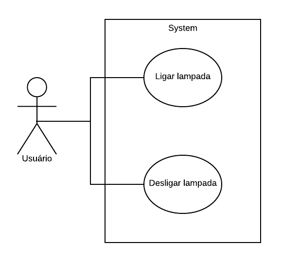

# Casos de uso

## 1. Diagrama de casos de uso

## 2. Especificação dos casos de uso

### 2.1. Caso de uso **Ligar Lampada**

| Campo          | Informação        |
|---|---|
| Identificador: | UC01              |
| Nome:          | Ligar Lampada |
| Atores:        | Usuário |
| Sumário:       | Envia sinal para o rele ligar a lampada |

| Fluxo Principal |
|---|
| 1) O usuário clica no botão de interruptor para ligar a lampada |
| 2) O sistema envia uma mensagem via mqqt para o servidor                   |
| 3) O servidor envia ao arduino a mensagem que a lampada foi ligada |
| 4) O arduino manda sinal para o rele |
| 5) O rele acende a lampada |

### 2.2. Caso de uso **Desligar Lampada**

| Campo          | Informação        |
|---|---|
| Identificador: | UC02              |
| Nome:          | Desligar Lampada |
| Atores:        | Usuário |
| Sumário:       | Envia sinal para o rele ligar a lampada |

| Fluxo Principal |
|---|
| 1) O usuário clica no botão de interruptor para desligar a lampada |
| 2) O sistema envia uma mensagem via mqqt para o servidor                   |
| 3) O servidor envia ao arduino a mensagem que a lampada foi desligada |
| 4) O arduino manda sinal para o rele |
| 5) O rele apaga a lampada |
